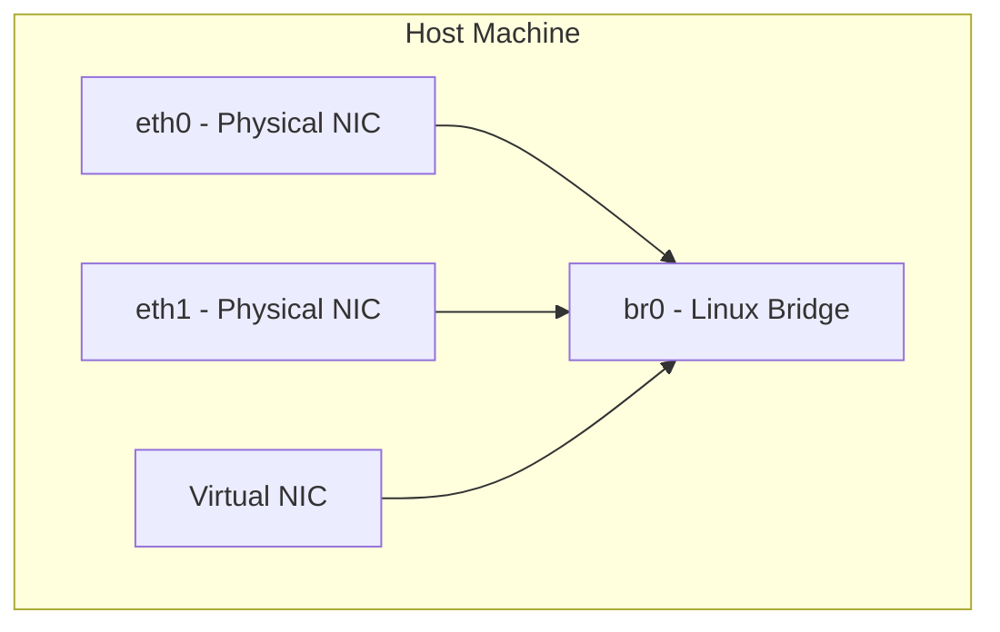

# 🧠 Lesson 1: Introduction to Linux Bridging

## 🎯 Learning Objectives

By the end of this lesson, you will be able to:

- Define what a Linux bridge is
- Understand the purpose and role of a Linux bridge in networking
- Describe how bridges fit into virtualization environments

---

## 📘 What is a Linux Bridge?

A **Linux bridge** is a software-based Layer 2 (Data Link Layer) device that behaves like a virtual network switch. It can connect multiple network interfaces and forward Ethernet frames between them based on MAC addresses — just like a physical Ethernet switch.

Bridges are foundational for virtualization — used to connect virtual machines (VMs) or containers to each other and to the outside world.

---

## 🖼️ Conceptual Diagrams

### ASCII Diagram

```
[ eth0 ]     [ eth1 ]
    \           /
     \         /
     [ Linux Bridge (br0) ]
              |
         [Virtual NIC / VM NIC]
```

### Mermaid.js Diagram



---

## 🧪 Hands-on Lab: Inspect and Create a Bridge

### 🛠️ Requirements

- Ubuntu 24.04
- 2+ network interfaces (physical or virtual)

### 🔧 Step-by-Step

```bash
# Ensure bridge utilities are available (modern tools)
sudo apt update
sudo apt install iproute2 bridge-utils -y

# Check existing interfaces
ip link show

# Create a new bridge interface
sudo ip link add name br0 type bridge

# Bring the bridge up
sudo ip link set dev br0 up

# Verify the bridge
ip link show br0
bridge link show
```

> ✅ Your bridge is now live — even without any ports added!

---

## ❓ Review Questions

1. At which OSI layer does a Linux bridge operate?
2. What command creates a Linux bridge named `br0`?
3. How is a Linux bridge used in virtualization?

### ✅ Answers

1. Layer 2 (Data Link Layer)
2. `sudo ip link add name br0 type bridge`
3. It connects VM or container NICs to the host and external networks.

---

## 🧯 Troubleshooting Tips

| Symptom | Cause | Fix |
|--------|--------|-----|
| `RTNETLINK answers: Operation not supported` | Kernel module `bridge` not loaded | Run `sudo modprobe bridge` |
| Bridge not forwarding packets | Interfaces not added or up | Use `ip link` to inspect and `ip link set dev ... up` |
| `brctl` commands not found | `brctl` deprecated | Use `ip` and `bridge` instead |

---

## 🌐 Real-World Use Case

When using **KVM**, creating a bridge allows VMs to be treated like physical machines on the same network as the host. For example, they can acquire IPs from your router via DHCP if the bridge includes a physical NIC.

---

Next up: **Lesson 2 - Comparing Linux Bridge with Other Network Models** 🚀
