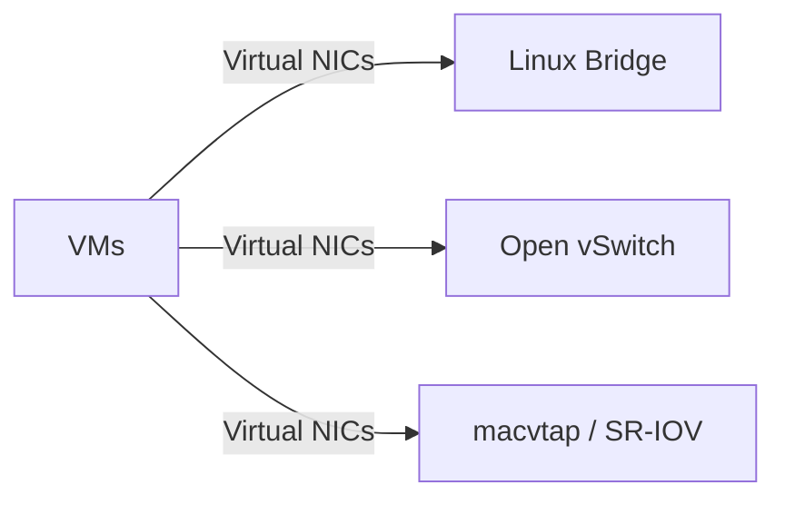

# 🧠 Lesson 2: Linux Bridge vs Other Networking Models

## 🎯 Learning Objectives

By the end of this lesson, you will be able to:

- Compare Linux bridges with physical switches and other virtual networking options
- Identify strengths and limitations of Linux bridges in different use cases

---

## 🧩 Key Comparisons

### 🔌 Linux Bridge vs Physical Switch

| Feature              | Linux Bridge                     | Physical Switch                  |
|----------------------|----------------------------------|----------------------------------|
| Medium               | Software                         | Hardware                         |
| MAC Learning         | Yes                              | Yes                              |
| Spanning Tree (STP)  | Yes (optional)                   | Yes (default)                    |
| VLAN Support         | Yes (via VLAN filtering)         | Yes                              |
| Speed                | CPU-dependent                    | ASIC hardware accelerated        |
| Use Case             | VMs, Containers, Virtual Labs    | LAN infrastructure               |

### 🖥️ Linux Bridge vs Open vSwitch (OVS)

| Feature              | Linux Bridge                     | Open vSwitch                     |
|----------------------|----------------------------------|----------------------------------|
| STP                  | Yes                              | Yes                              |
| VLANs                | Basic                            | Advanced                         |
| QoS/Traffic Shaping  | Minimal                          | Extensive                        |
| SDN Support          | Limited                          | Full (OpenFlow, OVSDB)           |
| Performance          | Moderate                         | High                             |
| Configuration Tools  | ip/bridge CLI                    | ovs-vsctl, ovs-ofctl             |
| Use Case             | Simple VM/container networking   | Complex SDN/cloud environments   |

---

## 🖼️ Conceptual Diagrams

### Mermaid.js Diagram: Virtual Switch Options



### ASCII Diagram

```
+------------+      +-------------+
| VM1        |----->|             |
|            |      |             |
| VM2        |----->|  br0        |----> eth0 (Host NIC)
|            |      |             |
+------------+      +-------------+
```

---

## 🧪 Hands-on Lab: Compare Linux Bridge vs OVS

> These steps require both `bridge-utils` and optionally `openvswitch-switch` for comparison.

```bash
# Install bridge and OVS tools
sudo apt update
sudo apt install bridge-utils iproute2 openvswitch-switch -y

# Create Linux bridge
sudo ip link add name br0 type bridge
sudo ip link set br0 up

# Create OVS bridge (optional)
sudo ovs-vsctl add-br ovs-br0
sudo ip link set ovs-br0 up

# List both bridges
bridge link
sudo ovs-vsctl list-br
```

---

## ❓ Quiz

**Q1.** Which of the following supports SDN protocols like OpenFlow?

- A) Linux bridge
- B) Physical switch
- C) Open vSwitch

**Answer:** ✅ C) Open vSwitch

**Q2.** What command do you use to add a Linux bridge?

- `ip link add name br0 type bridge`

---

## 🧯 Troubleshooting Tips

| Symptom | Cause | Solution |
|--------|--------|----------|
| `ovs-vsctl` not found | Open vSwitch not installed | `sudo apt install openvswitch-switch` |
| Bridge doesn’t forward | Interfaces not added or not up | Check with `ip link`, `bridge link` |
| VLANs not working | VLAN filtering not enabled | Use `bridge vlan` command |

---

## 🌐 Real-World Use Case

In a typical **KVM/libvirt** setup, Linux bridges provide external connectivity to VMs. For more complex needs, like **multi-tenant cloud** environments, **Open vSwitch** offers advanced SDN control and isolation.

---

Next up: **Lesson 3 - Creating and Managing Linux Bridges** 🔧
