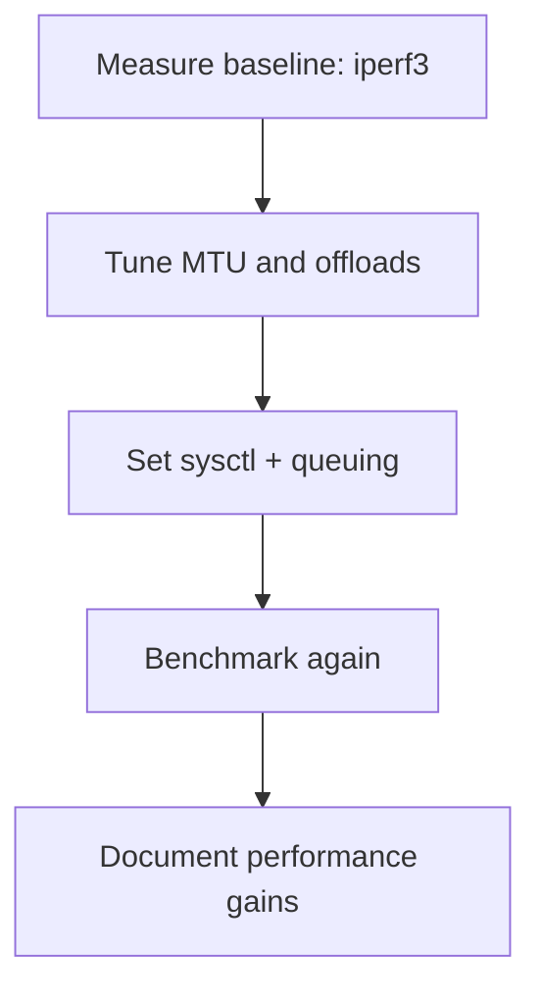

# 🧠 Lesson 10: Bridge Performance Tuning

## 🎯 Learning Objectives

By the end of this lesson, you will be able to:

- Identify key factors affecting Linux bridge performance
- Apply system and bridge-level tuning techniques
- Benchmark and monitor bridge throughput and latency

---

## 🚀 Why Performance Tuning Matters

In production and lab environments, a poorly configured bridge can:

- Limit throughput
- Increase latency
- Cause dropped packets under load

Tuning ensures your bridge scales well for virtualized networking and high-traffic scenarios.

---

## 📋 Key Tuning Parameters

### 1. MTU Optimization

Ensure the MTU (Maximum Transmission Unit) is consistent across all interfaces:

```bash
ip link set dev br0 mtu 1500
ip link set dev eth0 mtu 1500
```

### 2. Offloading Settings (Optional for Benchmarking)

```bash
# Show current settings
ethtool -k eth0

# Disable offloads to test raw performance
sudo ethtool -K eth0 gro off gso off tso off
```

### 3. CPU Affinity and Interrupt Coalescing

Distribute IRQs across CPU cores:

```bash
cat /proc/interrupts | grep eth0
# Then adjust using `irqbalance` or manual `smp_affinity` settings
```

---

## 🧪 Hands-on Lab: Benchmarking Bridge Performance

### Tool: iperf3

```bash
# On one namespace or VM (server)
ip netns exec ns1 iperf3 -s

# On another (client)
ip netns exec ns2 iperf3 -c 192.168.100.101
```

### Tool: `nload` or `bmon` for live interface monitoring

```bash
sudo apt install nload bmon
nload br0
```

---

## 🛠️ Bridge-Specific Sysctl Settings

### Increase Buffer Sizes

```bash
sudo sysctl -w net.core.rmem_max=16777216
sudo sysctl -w net.core.wmem_max=16777216
```

### Reduce Queuing Delay

```bash
sudo tc qdisc add dev br0 root fq
```

---

## 🖼️ Diagram: Tuning Workflow



---

## ❓ Review Questions

1. What command disables TCP segmentation offload?
2. Which sysctl setting increases socket receive buffer?
3. Name a tool to measure bridge bandwidth.

### ✅ Answers

1. `ethtool -K eth0 tso off`
2. `net.core.rmem_max`
3. `iperf3`

---

## 🧯 Troubleshooting Tips

| Symptom | Cause | Fix |
|--------|--------|-----|
| High latency | Bufferbloat or queuing issues | Use `tc qdisc add ... fq` |
| Low throughput | MTU mismatch or offload overhead | Align MTU and disable GRO/TSO |
| Packet drops | Low kernel buffer limits | Increase with `sysctl` settings |

---

## 🌐 Real-World Example

In a Kubernetes cluster with CNI bridge plugins, tuning MTU and offloads dramatically improves pod-to-pod throughput — especially over physical NICs or VXLAN overlays.

---

Next up: **Lesson 11 – VLAN Filtering on Linux Bridges** 🧵
