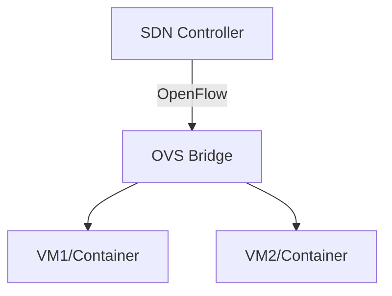

# 🧠 Lesson 14: Bridges in Software Defined Networking (SDN)

## 🎯 Learning Objectives

By the end of this lesson, you will be able to:

- Understand how Linux bridges fit into SDN architectures
- Compare Linux bridge and Open vSwitch in SDN scenarios
- Explore how SDN controllers interact with bridge-capable switches

---

## 🌐 What is SDN?

Software Defined Networking (SDN) separates the **control plane** (decisions) from the **data plane** (forwarding), allowing programmable and centralized network control.

Linux bridges normally operate locally — but in SDN, they are often used in:

- Small-scale setups
- Edge nodes
- Testing environments

For large SDN deployments, **Open vSwitch (OVS)** is commonly used instead.

---

## 🏗️ Linux Bridge vs Open vSwitch in SDN

| Feature                   | Linux Bridge     | Open vSwitch (OVS)         |
|---------------------------|------------------|-----------------------------|
| STP Support               | Yes              | Yes                         |
| VLAN Filtering            | Yes              | Yes                         |
| VXLAN/GRE Tunneling       | No (native)      | Yes (built-in)              |
| OpenFlow Support          | ❌ No             | ✅ Yes                       |
| Controller Integration    | Limited          | Full (via OVSDB/OpenFlow)   |
| Use in Kubernetes         | Basic (via CNI)  | Common in OVN, Cilium, etc. |

---

## 🧪 Hands-on Lab: Compare Bridge vs OVS

### 1. Install Open vSwitch

```bash
sudo apt update
sudo apt install openvswitch-switch -y
```

### 2. Create an OVS Bridge

```bash
sudo ovs-vsctl add-br ovs-br0
sudo ip link set dev ovs-br0 up
```

### 3. Add Interface

```bash
sudo ovs-vsctl add-port ovs-br0 eth1
```

### 4. Compare with Linux bridge

```bash
bridge link show
sudo ovs-vsctl show
```

> OVS bridges can be queried and configured via `ovs-vsctl` and `ovs-ofctl`, unlike `ip` or `bridge`.

---

## 🧠 SDN Controller Example (Bonus)

Using tools like **Ryu**, **ONOS**, or **OpenDaylight**, you can:

- Register OVS bridges with controllers
- Push flow rules remotely
- Manage VLANs, routing, and security centrally

> Linux bridges lack this programmability, which is why OVS is preferred in full SDN environments.

---

## 🖼️ Diagram: OVS in SDN



---

## ❓ Review Questions

1. Can Linux bridges be used in SDN?
2. Which bridge type supports OpenFlow?
3. What’s the role of `ovs-vsctl`?

### ✅ Answers

1. Yes, for basic edge functions or testing
2. Open vSwitch (OVS)
3. It configures and manages OVS bridges

---

## 🧯 Troubleshooting Tips

| Symptom | Cause | Fix |
|--------|--------|-----|
| SDN controller not detecting switch | Using Linux bridge | Use OVS with OpenFlow support |
| OVS bridge not forwarding | Port not added | Use `ovs-vsctl show` to inspect |
| Poor SDN performance | Software bridge | Consider DPDK-enabled OVS or hardware switch |

---

## 🌐 Real-World Example

In Kubernetes clusters using **OVN-Kubernetes** or **OpenShift**, each node runs Open vSwitch to connect pods and enforce network policies — all controlled by a central SDN controller.

---

Next up: **Lesson 15 – Bridge Use in Kubernetes and Cloud-Native Networking** ☁️
